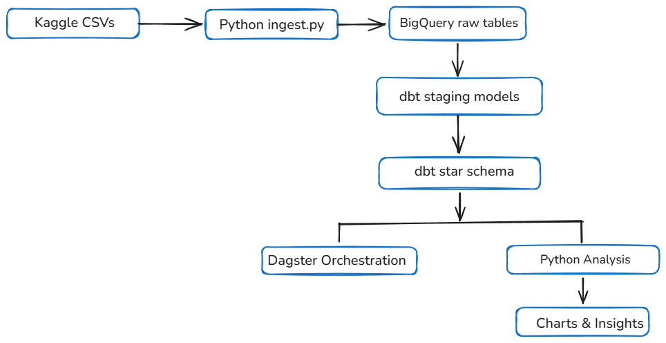
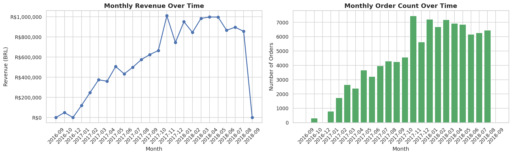
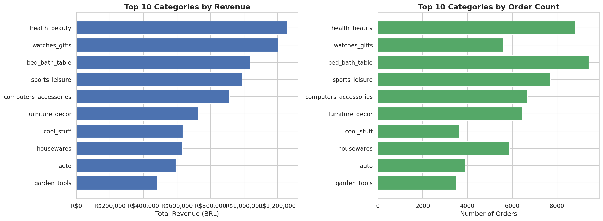
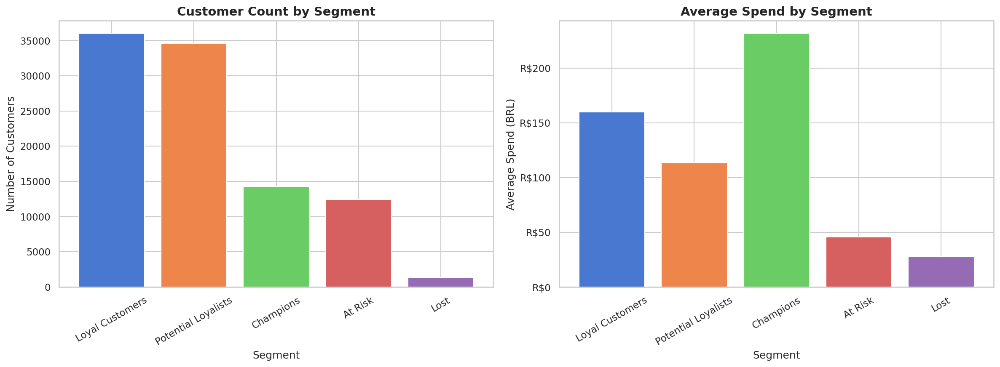
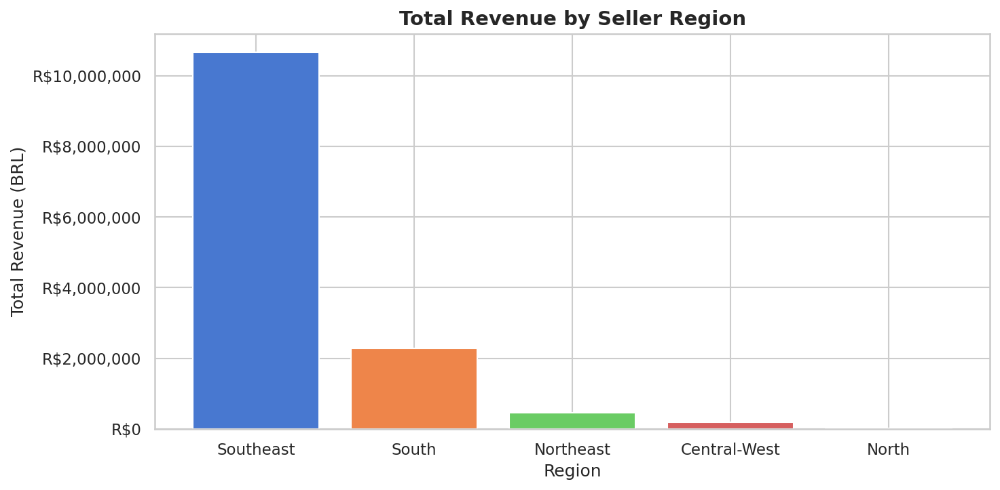

# Data Engineering Project Report

## 1. Executive Summary

This project built an end-to-end data pipeline using the Brazilian
E-Commerce (Olist) dataset. Raw transactional data was ingested into
Google BigQuery, transformed into a star schema using dbt, validated
with automated quality tests, and analysed using Python to surface
actionable business insights. The pipeline is fully automated using
Dagster and runs on a daily schedule.

---

## 2. Dataset Overview

- **Source**: Brazilian E-Commerce Dataset by Olist (Kaggle)
- **Size**: ~100,000 orders across 9 CSV files
- **Period**: 2016 – 2018
- **Key entities**: Orders, Customers, Products, Sellers, Payments, Reviews

---

## 3. Architecture Overview

### Tools chosen and why

| Layer | Tool | Reason |
|---|---|---|
| Cloud platform | Google BigQuery | Scalable, serverless, free tier sufficient |
| Ingestion | Python + pandas | Flexible, easy CSV handling |
| Transformation | dbt | Industry standard, SQL-based, built-in testing |
| Orchestration | Dagster | Modern UI, asset-based pipeline visibility |
| Analysis | pandas + matplotlib | Fast exploration, rich visualisation |
| Version control | GitHub | Required for submission, industry standard |

---

## 4. Data Warehouse Design

### Star schema justification

A star schema was chosen over a normalised (3NF) design because:

- **Simpler queries** — analysts need fewer JOINs to get answers
- **Faster aggregations** — BigQuery performs better with denormalised
  structures
- **Business friendly** — dimension tables read like plain English

### Schema structure

| Table | Type | Description |
|---|---|---|
| `fact_orders` | Fact | One row per order line item |
| `dim_customers` | Dimension | Customer location details |
| `dim_products` | Dimension | Product category and attributes |
| `dim_sellers` | Dimension | Seller location and region |
| `dim_time` | Dimension | Date breakdown by day/month/quarter |
| `dim_payments` | Dimension | Payment type and installments |

---

## 5. ELT Pipeline

### Pipeline stages

1. **Extract** — CSV files downloaded from Kaggle via the Kaggle API
2. **Load** — Raw CSVs loaded into BigQuery `ecommerce_raw` dataset
   using pandas + BigQuery Python client
3. **Transform** — dbt models clean and reshape data into star schema
   tables in `ecommerce_marts` dataset

### dbt model layers

- **Staging** — light cleaning: null filters, type casting, column
  renaming
- **Marts** — final star schema tables with business logic, derived
  columns, and joins

---

## 6. Data Quality

### Tests implemented

| Test | Type | Result |
|---|---|---|
| Primary key uniqueness | Generic (dbt) | Pass |
| Not null on key columns | Generic (dbt) | Pass |
| Valid order status values | Generic (dbt) | Pass |
| FK relationships | Generic (dbt) | Pass |
| Delivery after purchase date | Custom SQL | Pass |
| No negative prices | Custom SQL | Pass |
| No duplicate order items | Custom SQL | Pass |

### Known data issues found and resolved

| Issue | Rows affected | Resolution |
|---|---|---|
| Orders with no items | 778 rows | Filtered with INNER JOIN |
| Duplicate reviews per order | 661 rows | Kept latest review using ROW_NUMBER() |

---

## 7. Key Findings

### Monthly sales trend
- Revenue peaked in **November 2017** likely due to Black Friday
- Steady growth observed from mid-2017 onwards
- 

### Top product categories
- **Health & Beauty**, **Watches & Gifts**, and **Bed & Bath** are
  the top 3 revenue-generating categories
- 

### Customer segmentation (RFM)
- Majority of customers fall into the **At Risk** or **Lost** segments
  indicating a one-time purchase pattern
- Only a small percentage are **Champions** or **Loyal Customers**
- This suggests a focus on retention strategies would have high ROI
- 

### Seller performance by region
- **Southeast** region (São Paulo) dominates revenue
- This reflects Brazil's population and economic concentration
- 

---

## 8. Pipeline Orchestration

- **Tool**: Dagster
- **Schedule**: Full pipeline runs daily at midnight
- **Assets**: 4 assets in sequence —
  ingestion → transformation → quality tests → analysis
- **Benefit**: Any failure is immediately visible in the Dagster UI
  with full logs

---

## 9. Risks and Mitigations

| Risk | Impact | Mitigation |
|---|---|---|
| BigQuery API quota exceeded | Pipeline fails | Monitor usage, add retry logic |
| Kaggle dataset updated/changed | Schema breaks | Pin dataset version, add schema checks |
| dbt model failure | Stale data in marts | Dagster alerts on failure, dbt tests catch issues early |
| GCP credentials expire | All pipeline steps fail | Rotate service account keys regularly |

---

## 10. Future Improvements

- Add incremental dbt models to avoid full table refreshes
- Add a BI dashboard (Looker Studio or Metabase)
- Implement row-level data freshness checks
- Add Slack alerting when pipeline fails
- Move to Cloud Composer (managed Airflow) for production